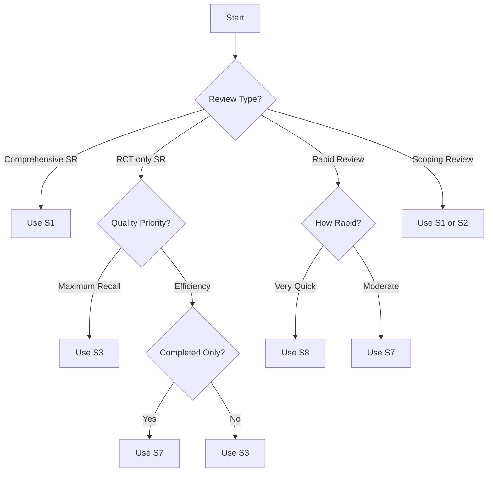

# Search Strategies

This guide describes the 10 validated search strategies available in the CT.gov Search Strategies toolkit, along with guidance on when to use each strategy.

## Strategy Overview

All strategies are based on the ClinicalTrials.gov API v2 and have been validated against Cochrane systematic review data.

| ID | Name | Retention | Sensitivity | Best For |
|----|------|-----------|-------------|----------|
| **S1** | Condition Only | 100% | High | Systematic reviews (maximum recall) |
| **S2** | Interventional Studies | 77% | High | RCT-focused reviews |
| **S3** | Randomized Allocation | 54% | Medium | True RCTs only |
| **S4** | Phase 3/4 Studies | 16% | Low | Late-phase efficacy trials |
| **S5** | Has Posted Results | 14% | Low | Trials with available results |
| **S6** | Completed Status | 55% | Medium | Finished trials only |
| **S7** | Interventional + Completed | 43% | Medium | Completed RCTs |
| **S8** | RCT + Phase 3/4 + Completed | 8% | Low | Highest quality subset |
| **S9** | Full-Text RCT Keywords | 72% | Medium | Text-based RCT search |
| **S10** | Treatment RCTs Only | 36% | Medium | Treatment purpose trials |

!!! note "Retention"
    Retention percentage shows how many studies are retained compared to S1 (condition-only baseline). Lower retention means fewer results to screen.

## Detailed Strategy Descriptions

### S1: Condition Only (Maximum Recall)

**Description:** Searches by condition only with no additional filters. This is the Cochrane-recommended approach for systematic reviews requiring maximum sensitivity.

**Query Pattern:**
```
query.cond={condition}
```

**When to Use:**

- Systematic reviews requiring comprehensive coverage
- Scoping reviews
- When you cannot afford to miss any relevant trials
- As a baseline for comparing other strategies

**Advantages:**

- Maximum recall (all matching studies)
- Cochrane-recommended approach
- No risk of missing studies due to filtering

**Disadvantages:**

- Highest screening burden
- Many irrelevant results to review
- Time-consuming screening process

**Example:**

```python
from ctgov_search import CTGovSearcher

searcher = CTGovSearcher()
result = searcher.search("diabetes", strategy="S1")
print(f"Total studies: {result.total_count:,}")
```

---

### S2: Interventional Studies

**Description:** Filters to interventional study types only, excluding observational studies.

**Query Pattern:**
```
query.cond={condition}&query.term=AREA[StudyType]INTERVENTIONAL
```

**When to Use:**

- When you only need interventional studies
- Meta-analyses of treatment effects
- Reviews excluding observational data

**Validation Results:**

| Metric | Value |
|--------|-------|
| Retention | 77% |
| Recall (vs gold standard) | 53.9% |
| NNS improvement | ~23% |

---

### S3: Randomized Allocation Only

**Description:** Filters to randomized allocation design, identifying true RCTs while excluding single-arm and non-randomized studies.

**Query Pattern:**
```
query.cond={condition}&query.term=AREA[DesignAllocation]RANDOMIZED
```

**When to Use:**

- RCT-only systematic reviews
- Cochrane intervention reviews
- Meta-analyses requiring randomization
- When study quality is critical

**Advantages:**

- Best balance of recall and precision
- Excludes non-randomized studies
- Maintains good recall for RCTs

**Validation Results:**

| Metric | Value |
|--------|-------|
| Retention | 54% |
| Recall | 63.2% |
| Recommended | **Best balance** |

---

### S4: Phase 3/4 Studies

**Description:** Filters to later-phase clinical trials (Phase 3 and Phase 4) only.

**Query Pattern:**
```
query.cond={condition}&query.term=AREA[Phase](PHASE3 OR PHASE4)
```

**When to Use:**

- Reviews focused on efficacy trials
- Regulatory submission evidence
- Large-scale effectiveness studies

**Limitations:**

- Excludes Phase 1/2 studies
- May miss important early-phase data
- Limited to later development stages

---

### S5: Has Posted Results

**Description:** Filters to studies that have posted results on ClinicalTrials.gov.

**Query Pattern:**
```
query.cond={condition}&query.term=AREA[ResultsFirstPostDate]RANGE[MIN,MAX]
```

**When to Use:**

- When you need studies with available results
- Identifying publication bias
- Finding trials with outcome data

**Limitations:**

- Only ~14% of trials have posted results
- May miss important completed trials
- Not comprehensive for systematic reviews

---

### S6: Completed Status

**Description:** Filters to trials with "Completed" overall status.

**Query Pattern:**
```
query.cond={condition}&filter.overallStatus=COMPLETED
```

**When to Use:**

- Reviews focused on finished trials
- Avoiding ongoing studies
- When you need final results

**Validation Results:**

| Metric | Value |
|--------|-------|
| Retention | 55% |
| Recall | 51.7% |

---

### S7: Interventional + Completed

**Description:** Combines interventional study type with completed status for finished RCTs.

**Query Pattern:**
```
query.cond={condition}&query.term=AREA[StudyType]INTERVENTIONAL&filter.overallStatus=COMPLETED
```

**When to Use:**

- Systematic reviews of completed RCTs
- Meta-analyses requiring final data
- Reviews with clear completion criteria

**Validation Results:**

| Metric | Value |
|--------|-------|
| Retention | 43% |
| Recall | 56.8% |
| Workload reduction | 57% vs S1 |

---

### S8: RCT + Phase 3/4 + Completed

**Description:** Most restrictive filter combining randomized, Phase 3/4, and completed criteria for highest quality subset.

**Query Pattern:**
```
query.cond={condition}&query.term=AREA[DesignAllocation]RANDOMIZED AND AREA[Phase](PHASE3 OR PHASE4)&filter.overallStatus=COMPLETED
```

**When to Use:**

- Rapid reviews with quality focus
- When only highest quality evidence needed
- Guideline development with strict criteria

**Limitations:**

- Very low recall (~8% retention)
- May miss important smaller trials
- Not suitable for comprehensive reviews

---

### S9: Full-Text RCT Keywords

**Description:** Text-based search combining condition with RCT-related keywords.

**Query Pattern:**
```
query.term={condition} AND randomized AND controlled
```

**When to Use:**

- When condition field may be incomplete
- Supplementing structured searches
- Finding trials with RCT in title/description

**Validation Results:**

| Metric | Value |
|--------|-------|
| Retention | 72% |
| Recall | 51.6% |

---

### S10: Treatment RCTs Only

**Description:** Randomized trials with treatment as primary purpose.

**Query Pattern:**
```
query.cond={condition}&query.term=AREA[DesignAllocation]RANDOMIZED AND AREA[DesignPrimaryPurpose]TREATMENT
```

**When to Use:**

- Treatment-focused reviews
- Excluding prevention/diagnostic trials
- When therapeutic effect is primary outcome

**Validation Results:**

| Metric | Value |
|--------|-------|
| Retention | 36% |
| Recall | 60.0% |

## Performance Comparison

### Recall vs. Screening Burden

```
Strategy  | Recall | Retention | Workload Reduction
----------|--------|-----------|--------------------
S1        | 48.2%  | 100%      | Baseline
S2        | 53.9%  | 77%       | 23%
S3        | 63.2%  | 54%       | 46%
S4        | 34.4%  | 16%       | 84%
S5        | 55.5%  | 14%       | 86%
S6        | 51.7%  | 55%       | 45%
S7        | 56.8%  | 43%       | 57%
S8        | 33.8%  | 8%        | 92%
S9        | 51.6%  | 72%       | 28%
S10       | 60.0%  | 36%       | 64%
```

## Strategy Selection Flowchart



## Recommendations by Use Case

### Systematic Reviews

| Type | Recommended | Alternative |
|------|-------------|-------------|
| Cochrane Intervention Review | S1 then S3 | S1 only |
| PRISMA Compliant | S1 | S3 |
| Living Systematic Review | S1 with date filter | S2 |

### Rapid Reviews

| Type | Recommended | Alternative |
|------|-------------|-------------|
| Evidence Summary | S3 or S7 | S8 |
| Guideline Support | S7 | S3 |
| Quick Assessment | S8 | S4 |

### Meta-Analyses

| Type | Recommended | Alternative |
|------|-------------|-------------|
| Treatment Effect | S3 | S10 |
| Network Meta-Analysis | S1 then S3 | S2 |
| IPD Meta-Analysis | S7 | S6 |

## Best Practices

### 1. Always Document Your Strategy

Record which strategy you used and why:

```python
from ctgov_search import CTGovSearcher

searcher = CTGovSearcher()

# Document in your protocol
SEARCH_STRATEGY = "S3"
RATIONALE = "RCT-only systematic review, balanced recall and precision"

result = searcher.search("hypertension", strategy=SEARCH_STRATEGY)
```

### 2. Consider Multiple Strategies

For comprehensive reviews, consider running multiple strategies:

```python
from ctgov_search import CTGovSearcher

searcher = CTGovSearcher()

# Primary search
primary = searcher.search("diabetes", strategy="S1")

# Secondary validation
secondary = searcher.search("diabetes", strategy="S3")

print(f"S1: {primary.total_count:,} studies")
print(f"S3: {secondary.total_count:,} studies")
print(f"Reduction: {100 - (secondary.total_count/primary.total_count*100):.1f}%")
```

### 3. Supplement with AACT Database

For maximum recall, supplement API searches with AACT database:

```python
# CT.gov API may miss ~12.7% of NCT IDs
# Use AACT for validation

from aact_validation import validate_via_aact

known_ncts = ["NCT12345678", "NCT87654321"]
found = validate_via_aact(known_ncts)
```

### 4. Use Synonym Expansion

Improve recall with automatic synonym expansion:

```python
from ctgov_search import CTGovSearcher

searcher = CTGovSearcher(synonyms_path="data/condition_synonyms.json")

# Expands "diabetes" to include "diabetes mellitus", "T2DM", etc.
result = searcher.search_with_synonyms("diabetes", strategy="S1")
```

## API Strategy Reference

Access strategy metadata programmatically:

```python
from ctgov_search import CTGovSearcher

# List all strategies
for strategy_id, config in CTGovSearcher.STRATEGIES.items():
    print(f"{strategy_id}:")
    print(f"  Name: {config['name']}")
    print(f"  Description: {config['description']}")
    print(f"  Retention: {config['retention']}%")
    print(f"  Sensitivity: {config['sensitivity']}")
    print()
```
