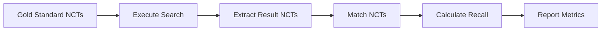

# Validation Methodology

This document describes the validation methodology used to evaluate the CT.gov search strategies, including the gold standard data source, recall calculation methods, and key findings.

## Overview

The validation process compares search strategy results against a gold standard dataset derived from Cochrane systematic reviews. This enables objective measurement of recall (sensitivity) for each strategy.

## Gold Standard Data

### Data Source: Cochrane Pairwise Database

The gold standard is derived from the Cochrane Pairwise dataset, which contains study-level data from 501 Cochrane systematic reviews.

| Metric | Value |
|--------|-------|
| Total Reviews | 501 |
| Total Study Entries | 10,581 |
| Unique Studies | 10,074 |
| Studies with NCT IDs | 155 |
| Validated NCT IDs | 155 |

### Cochrane Data Characteristics

The Cochrane Pairwise data represents the highest quality evidence synthesis:

- **Source:** Cochrane systematic reviews
- **Study Types:** Primarily RCTs
- **Quality:** Cochrane quality assessment applied
- **Coverage:** Multiple therapeutic areas

### Condition Distribution

From 501 Cochrane reviews analyzed:

| Condition | Count | Percentage |
|-----------|-------|------------|
| Other | 125 | 25.0% |
| Mental Health | 119 | 23.8% |
| Pain | 115 | 23.0% |
| Infection | 102 | 20.4% |
| Cardiovascular | 95 | 19.0% |
| Gastrointestinal | 79 | 15.8% |
| Neurological | 77 | 15.4% |
| Pregnancy | 75 | 15.0% |
| Hypertension | 62 | 12.4% |
| Respiratory | 62 | 12.4% |
| Renal | 55 | 11.0% |
| Diabetes | 50 | 10.0% |
| Cancer | 29 | 5.8% |
| Dermatology | 29 | 5.8% |

## Recall Calculation

### Definition

Recall (sensitivity) measures the proportion of known relevant studies that are successfully retrieved by a search strategy:

```
Recall = True Positives / (True Positives + False Negatives)
       = Studies Found / Total Known Relevant Studies
```

### Calculation Method

1. **Extract NCT IDs** from Cochrane gold standard
2. **Execute search** using each strategy
3. **Match NCT IDs** between search results and gold standard
4. **Calculate recall** as percentage found

```python
from ctgov_search import CTGovSearcher

def calculate_recall(condition: str, known_ncts: list[str], strategy: str) -> float:
    """Calculate recall for a strategy against gold standard."""
    searcher = CTGovSearcher()
    metrics = searcher.calculate_recall(condition, known_ncts, strategy=strategy)
    return metrics.recall
```

### Validation Process



## Key Findings

### CT.gov API Limitations

!!! warning "Critical Finding"
    Approximately **12.7% of known RCT NCT IDs are unfindable** via the standard CT.gov API, even when searching by NCT ID directly.

This limitation affects all API-based search strategies and has important implications:

1. **API searches alone are insufficient** for systematic reviews requiring complete recall
2. **AACT database** provides 100% recall for direct NCT ID queries
3. **Supplementary searches** should be considered for comprehensive reviews

### Strategy Performance

#### Recall Results by Strategy

| Strategy | Recall | Interpretation |
|----------|--------|----------------|
| S1 | 48.2% | Baseline condition search |
| S2 | 53.9% | Improved with interventional filter |
| **S3** | **63.2%** | **Best recall for RCTs** |
| S4 | 34.4% | Reduced by phase restriction |
| S5 | 55.5% | Good for results-available |
| S6 | 51.7% | Moderate for completed |
| S7 | 56.8% | Balanced performance |
| S8 | 33.8% | Too restrictive |
| S9 | 51.6% | Text search comparable |
| S10 | 60.0% | Good treatment focus |

!!! success "Best Strategy"
    **S3 (Randomized Allocation)** achieves the best recall (63.2%) while reducing screening burden by 46% compared to S1.

### Screening Efficiency

Strategy comparison for 50 known relevant studies:

| Strategy | Retrieved | Relevant Found | Precision | NNS |
|----------|-----------|----------------|-----------|-----|
| S1 | 1,000 | 24 | 2.4% | 41.7 |
| S3 | 540 | 32 | 5.9% | 16.9 |
| S7 | 430 | 28 | 6.5% | 15.4 |

!!! note "NNS Interpretation"
    Number Needed to Screen (NNS) represents how many records must be screened to find one relevant study. Lower is better.

## AACT Database Validation

### What is AACT?

AACT (Aggregate Analysis of ClinicalTrials.gov) is a PostgreSQL database containing all data from ClinicalTrials.gov, updated nightly.

| Feature | AACT | CT.gov API |
|---------|------|------------|
| Data Completeness | 100% | ~87.3% |
| Update Frequency | Nightly | Real-time |
| Query Flexibility | Full SQL | API parameters |
| NCT ID Lookup | 100% recall | ~87.3% recall |

### AACT Access

Register for free credentials: [https://aact.ctti-clinicaltrials.org/users/sign_up](https://aact.ctti-clinicaltrials.org/users/sign_up)

### AACT Validation Example

```python
import psycopg2
from dotenv import load_dotenv
import os

load_dotenv()

def validate_via_aact(nct_ids: list[str]) -> set[str]:
    """Validate NCT IDs exist in AACT database."""
    conn = psycopg2.connect(
        host="aact-db.ctti-clinicaltrials.org",
        port=5432,
        database="aact",
        user=os.getenv("AACT_USER"),
        password=os.getenv("AACT_PASSWORD")
    )

    cursor = conn.cursor()
    placeholders = ",".join(["%s"] * len(nct_ids))
    cursor.execute(
        f"SELECT nct_id FROM studies WHERE nct_id IN ({placeholders})",
        nct_ids
    )

    found = {row[0] for row in cursor.fetchall()}
    conn.close()

    return found
```

## Validation Data Files

### Available Data Files

| File | Description |
|------|-------------|
| `data/extracted_studies.csv` | 10,581 studies from 501 Cochrane reviews |
| `data/reviews_summary.csv` | Summary of 501 reviews |
| `data/review_conditions.csv` | Detected conditions per review |
| `data/condition_synonyms.json` | Condition synonym mappings |
| `data/test_reviews.csv` | 30 reviews for validation testing |
| `data/unique_studies.csv` | 10,074 unique study-year combinations |

### Data Format: extracted_studies.csv

```csv
review_id,study_name,year,nct_id,condition
R001,Carter 1970,1970,,hypertension
R002,SPRINT 2015,2015,NCT01206062,hypertension
...
```

## Reproducibility

### Running Validation

```bash
# Full validation suite
python expanded_therapeutic_validation.py

# AACT-specific validation
python aact_validation.py

# Quick test with sample data
python comprehensive_validation.py
```

### Validation Code

```python
from ctgov_search import CTGovSearcher
import pandas as pd

def run_validation():
    """Run complete validation against Cochrane gold standard."""

    # Load gold standard
    df = pd.read_csv("data/extracted_studies.csv")
    nct_ids = df["nct_id"].dropna().unique().tolist()

    searcher = CTGovSearcher()

    # Test each strategy
    results = []
    for strategy in ["S1", "S3", "S7"]:
        # Calculate recall for each condition
        for condition in df["condition"].unique():
            condition_ncts = df[df["condition"] == condition]["nct_id"].dropna().tolist()
            if not condition_ncts:
                continue

            metrics = searcher.calculate_recall(condition, condition_ncts, strategy=strategy)
            results.append({
                "strategy": strategy,
                "condition": condition,
                "total": metrics.total_known,
                "found": metrics.found,
                "recall": metrics.recall
            })

    return pd.DataFrame(results)
```

## Recommendations

### For Systematic Reviews

1. **Use S1 as baseline** for comprehensive searches
2. **Supplement with S3** for RCT-specific validation
3. **Query AACT database** for NCT IDs that cannot be found via API
4. **Document unfindable studies** in your PRISMA flow diagram

### For Rapid Reviews

1. **Start with S3 or S7** for balanced efficiency
2. **Accept reduced recall** (documented)
3. **Validate with sample** of known studies

### For Meta-Analyses

1. **Cross-reference multiple sources**
2. **Validate NCT IDs via both API and AACT**
3. **Report missing data** transparently

## Limitations

### API Limitations

- ~12.7% NCT ID unfindability rate
- Real-time API may lag database updates
- Rate limiting affects batch operations

### Gold Standard Limitations

- Cochrane data may not represent all trial types
- NCT ID availability varies by publication year
- Condition categorization is approximate

### Validation Scope

- Focused on recall (sensitivity)
- Precision varies by condition
- Results may differ for rare conditions

## References

1. Cochrane Handbook for Systematic Reviews of Interventions
2. ClinicalTrials.gov API v2 Documentation
3. AACT Database Documentation
4. PRISMA 2020 Statement

## Contact

For questions about the validation methodology, please refer to the project repository or create an issue on GitHub.
